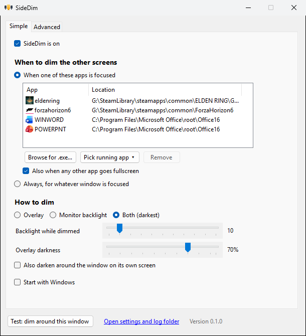
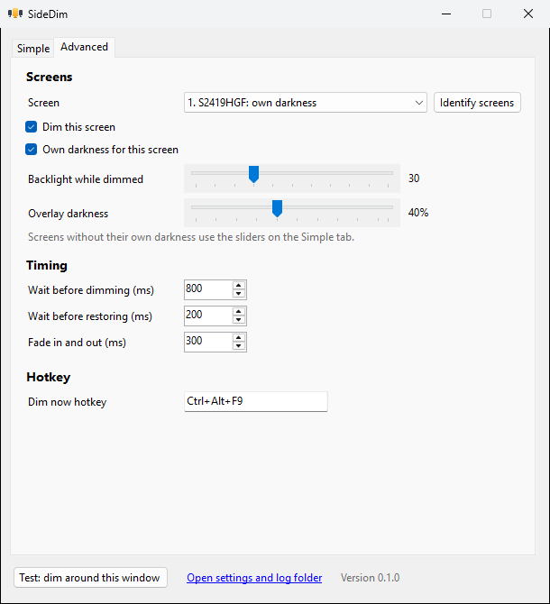

<p align="center">
  
</p>

<h1 align="center">SideDim</h1>

<p align="center"><b>Dims everything except what you're focused on.</b></p>

<p align="center">
  <a href="https://github.com/Quintinator/SideDim/releases/latest"></a>
  <a href="https://github.com/Quintinator/SideDim/actions/workflows/ci.yml"></a>
  
  <a href="LICENSE"></a>
</p>

SideDim is a small Windows tray app that darkens every screen except the one you're using. Alt-tab out and they come back at the brightness they had before.

**For gaming.** Your second and third screens go dark while you play, so Discord, a browser or a stream on the side stops pulling at your eyes, and the room gets darker too. It works with borderless and exclusive fullscreen and never takes focus away from the game.

**For work.** Writing, coding, a video call or a presentation: add the app, or let SideDim follow whatever window has focus. With Spotlight on, even the rest of the main screen fades, so only the window you're working in stays lit.

Only one screen? SideDim works there too: it darkens everything around the focused window, so only the app you're using stays lit.

<p align="center">
  
  
</p>

## Features

- **Pick your apps.** Add games and work apps by browsing to an `.exe` or picking from what's running, Microsoft Store and Game Pass apps included. Apps are matched by exe name, so moving one to another drive doesn't break anything.
- **Any fullscreen app.** Optionally dim for anything that covers a whole monitor: games you haven't added, videos, presentations.
- **Always mode.** Dim around whatever window has focus, handy for focused work.
- **Three ways to dim:**
  | Method | How | Best for |
  |---|---|---|
  | Overlay | A black, click-through layer over each other screen | Works on every monitor, smooth fades |
  | Monitor backlight | Turns the monitor's real brightness down over DDC/CI | Less light in the room |
  | Both | Backlight down plus the overlay on top | As dark as it gets without turning screens off |
- **Spotlight.** Also darkens the focused window's own screen, leaving only the window lit. The cut-out follows the window when you move it.
- **Works on a single monitor.** With one screen there's nothing beside it to dim, so SideDim turns the spotlight on by itself. The backlight options need a second monitor, so they're greyed out until one is connected; your choice is kept and comes back when you plug one in.
- **Two sliders.** One for the backlight level, one for overlay darkness. A screen you already turned down further is never brightened.
- **Per-screen settings.** On the Advanced tab, give a screen its own darkness (say, the one next to you a bit lighter) or set it to never dim (the one with your stream chat or meeting notes).
- **Identify screens.** Shows a big number and the monitor's name on each screen, so two identical monitors are easy to tell apart.
- **Simple and Advanced tabs.** The everyday choices on one tab; per-screen settings, timing and the hotkey on the other.
- **Test button.** Uses the settings window as the focused app, so you can tune everything live without starting a game or opening a document.
- **Dim now hotkey.** `Ctrl+Alt+F9` by default, for a quick focus session, a windowed game or a video. Any combination with Ctrl or Alt works; bare keys and Alt+F4 are refused so SideDim never steals keys from games or other apps. Windows treats Ctrl+Alt as AltGr, so if your pick would block a character like é or € on one of your keyboard layouts, SideDim warns you.
- **Your brightness comes back.** SideDim saves each monitor's brightness to disk before it changes anything. After a crash or power cut, the next start restores it. An unplugged monitor is restored when it comes back.
- **Never steals focus.** Overlays can't be clicked or focused, so exclusive fullscreen games don't minimize and your typing never lands in the wrong window.
- **Start with Windows.** A toggle in the settings window and in the tray menu.
- One small exe. No installer, no admin rights, no network access.

## Install

1. Download the latest exe from [Releases](https://github.com/Quintinator/SideDim/releases/latest):
   - `SideDim-x.y.z-win-x64.exe` runs anywhere (about 50 MB, includes .NET).
   - `SideDim-x.y.z-win-x64-needs-dotnet10.exe` is under 1 MB but needs the [.NET 10 Desktop Runtime](https://dotnet.microsoft.com/download/dotnet/10.0).
2. Run it. The settings window opens the first time; after that SideDim lives in the tray.

Keep the exe in a folder of its own, not loose in Downloads, the Desktop or Documents: a harmful file saved next to it there could be loaded when SideDim starts. The large exe checks this when it starts and offers to move itself to `%LOCALAPPDATA%\Programs\SideDim`, with a Start menu shortcut.

Each release also has `SHA256SUMS.txt`: `Get-FileHash` on your download should match the line for that file.

Windows 10 or 11.

### "Windows protected your PC"

SideDim isn't code signed, so Windows doesn't know who made it, and SmartScreen warns when you first run a downloaded copy. Click **More info**, then **Run anyway**. Each new release starts without a track record, so the warning can come back after an update.

**Smart App Control** (Windows 11, in Windows Security under App & browser control) is stricter: it blocks unsigned apps that Microsoft's cloud service doesn't recognize as safe, and it has no Run anyway button. A new SideDim release will most likely be blocked while it is on.

Why not sign it? A certificate costs money every year and would get SideDim past Smart App Control, but SmartScreen keeps warning about a newly signed app too until enough people have installed it. To check that your download is the real one, use `SHA256SUMS.txt` as described above.

## Controls

| Action | What it does |
|---|---|
| Left-click the tray icon | Opens settings |
| Right-click the tray icon | Settings, automatic dimming on/off, Dim now, Dim for *last app*, Start with Windows, Exit |
| `Ctrl+Alt+F9` | Dim now, press again to stop (changeable in settings) |
| Start the exe again | Opens the settings of the copy that's already running |

## Settings

Everything in the settings window applies immediately. Settings are stored in `%APPDATA%\SideDim\settings.json`. You can edit that file by hand: values out of range are repaired, and a file that can't be read is kept as `settings.json.broken-<date>` instead of being overwritten.

| Setting | Default | Meaning |
|---|---|---|
| `Enabled` | `true` | Automatic dimming on or off |
| `Trigger` | `SelectedApps` | `SelectedApps`: only for apps in the list. `AnyWindow`: for whatever window has focus |
| `Apps` | `[]` | Exe paths or process names to dim for |
| `AlsoAnyFullscreen` | `true` | With `SelectedApps`, also dim for any app that covers a whole monitor |
| `Mode` | `Overlay` | `Overlay`, `Hardware` (backlight) or `Both`. With one monitor only the overlay is used |
| `BacklightLevel` | `10` | Monitor brightness while dimmed, 0 to 100 |
| `OverlayStrength` | `70` | Overlay darkness in percent, 0 to 95 |
| `Spotlight` | `false` | Also darken around the focused window on its own screen. Always on when only one monitor is connected |
| `NeverDimFor` | `[]` | Extra apps that never trigger dimming (file only). Explorer, the Start menu, search and the snipping tools are always excluded |
| `DimDelayMs` | `800` | How long a window must have focus before dimming, so quick alt-tabs don't flicker |
| `RestoreDelayMs` | `200` | How long before restoring after focus leaves |
| `FadeMs` | `300` | Overlay fade time, 0 to 2000 |
| `ToggleHotkey` | `Ctrl+Alt+F9` | The Dim now hotkey. A function key is the default because Ctrl+Alt+letter is AltGr+letter on many keyboard layouts; SideDim warns when your choice would block a character |
| `AltGrWarnedFor` | `null` | Remembers which AltGr clash the startup notification already named, so it shows once (file only) |
| `WarnAboutFolder` | `true` | The large exe offers to move itself out of Downloads and other shared folders. **Don't ask again** sets this to `false` |
| `Monitors` | `{}` | Per-screen overrides, keyed by the monitor's id: `Dim` (false = never dim), `BacklightLevel` and `OverlayStrength` (leave out to use the shared value). Easiest to set on the Advanced tab |

## Command line

| Flag | What it does |
|---|---|
| `--probe` | Lists each monitor with its name, whether it answers DDC/CI and its current brightness. Printed to the console and written to the log, handy for bug reports. |

## Files

In `%APPDATA%\SideDim\` unless noted (there's a link at the bottom of the settings window):

| File | Contents |
|---|---|
| `settings.json` | Your settings |
| `sidedim.log` | What SideDim did and any errors. The previous log is kept as `sidedim.log.old`. |
| `hardware-state.json` | Brightness to restore. Only exists while a screen is dimmed, and lives in `%LOCALAPPDATA%\SideDim\` because it belongs to this PC's monitors. |

## Uninstall

Turn off Start with Windows, exit SideDim from the tray, then delete the exe (or `%LOCALAPPDATA%\Programs\SideDim`), the SideDim Start menu shortcut if there is one, and the `SideDim` folders in `%APPDATA%` and `%LOCALAPPDATA%`.

## Troubleshooting

- **Backlight mode does nothing on a screen.** Turn on DDC/CI in that monitor's on-screen menu, then run `SideDim.exe --probe`. Some monitors, docks and most laptop panels don't support DDC/CI; use Overlay for those.
- **The hotkey shows "In use by another app".** Another program registered that combination first. Pick a different one.
- **A character like é or € stopped working.** Your hotkey is probably Ctrl+Alt plus that key, which Windows also uses for AltGr. Pick another hotkey, for example `Ctrl+Alt+F9`.
- **A screen stayed dark.** Start SideDim again: it restores whatever is in `%LOCALAPPDATA%\SideDim\hardware-state.json`. You can also set the brightness in the monitor's own menu.
- **Anti-cheat.** SideDim never touches game processes. It only asks Windows which window has focus and which exe owns it.
- **Something else?** [Open an issue](https://github.com/Quintinator/SideDim/issues) and include the output of `SideDim.exe --probe` and your `sidedim.log`.

## How it works

- Every 100 ms it checks the foreground window, its monitor and its exe. A target must hold for `DimDelayMs` before anything changes.
- Overlays are borderless, topmost, layered windows with `WS_EX_TRANSPARENT` and `WS_EX_NOACTIVATE`, so clicks pass through and focus never moves.
- Backlight changes use VESA MCCS (VCP code `0x10`) through `dxva2.dll`, on a background thread because each call takes tens of milliseconds.

## Building from source

Needs the [.NET 10 SDK](https://dotnet.microsoft.com/download/dotnet/10.0).

```powershell
./build.ps1               # restore, format check, build, tests, publish (exactly what CI runs)
./build.ps1 -SkipPublish  # quick check before committing
dotnet test               # tests only
```

Exes land in `artifacts/publish/`. `tools/make-icon.ps1` regenerates the icon from code.

To release: add a `## [x.y.z]` section to [CHANGELOG.md](CHANGELOG.md), then push a tag `vx.y.z`. GitHub Actions builds, tests and publishes the release with both exes, the license and checksums.

Contributions are welcome. Please run `./build.ps1` before opening a pull request.

## License

SideDim is free, and it stays free. It's released under the [MIT license with the Commons Clause](LICENSE):

- **You can** use it anywhere (at home, at work, on stream), read the code, fork it, change it and share your version for free.
- **You can't** sell SideDim, or sell anything whose value comes mainly from SideDim.

Strictly speaking this makes SideDim "source-available" rather than OSI open source; the only thing it takes away is the right to sell it.

---

<sub>Made with the help of AI.</sub>
